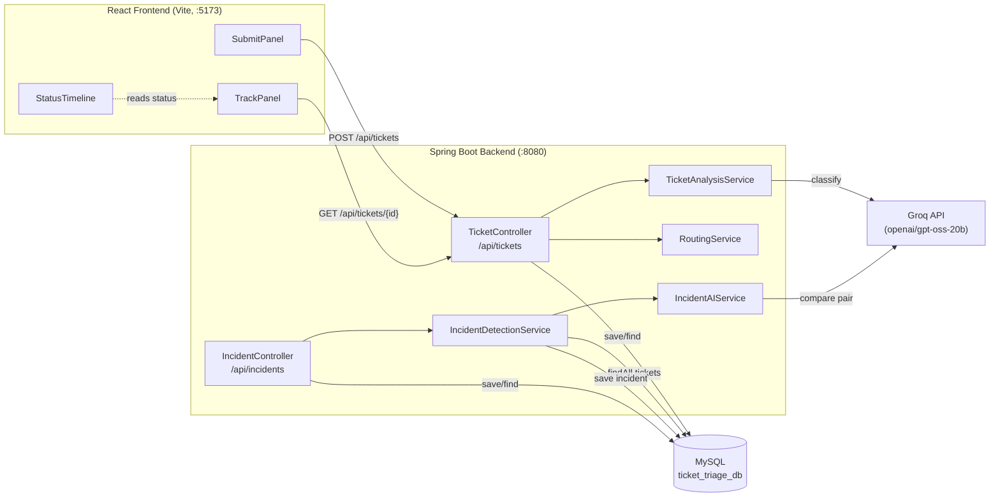
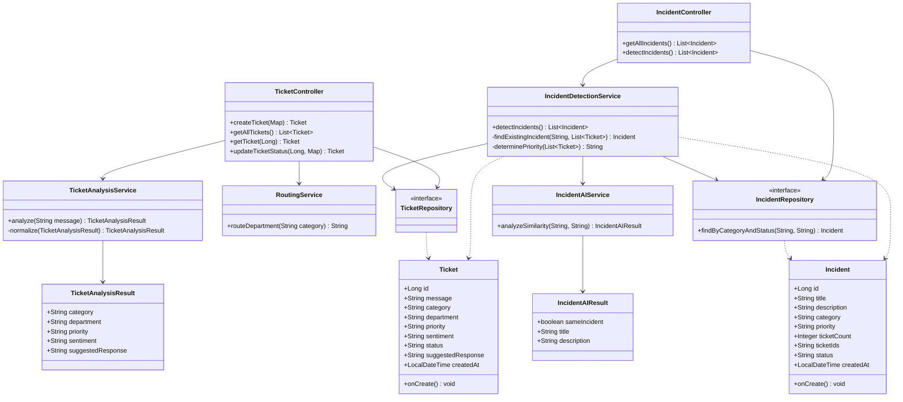
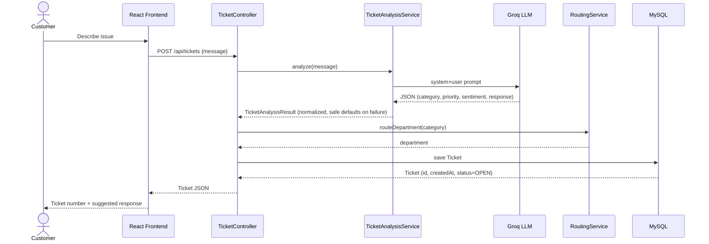

# 🎫 Ticket Triage

An AI-powered customer support ticket triage system. Customers submit a support
message in plain language; the backend uses an LLM (via Groq, OpenAI-compatible
API) to classify it, route it to the right department, gauge sentiment and
priority, and draft a suggested response — then groups related tickets into
**incidents** when multiple customers report the same underlying issue.

## ✨ Features

- **Automatic classification** — category, department, priority, and sentiment
  are inferred from the raw ticket message by an LLM.
- **Smart routing** — tickets are routed to Billing, Account, Technical, or
  Logistics based on category.
- **Suggested responses** — a short, empathetic draft reply is generated for
  every ticket, without inventing promises, refunds, or order details.
- **Status tracking** — customers can look up a ticket by ID and follow it
  through `OPEN → IN_PROGRESS → RESOLVED`.
- **Incident detection** — tickets in the same category are AI-compared
  pairwise; when several describe the same underlying problem, they're
  clustered into an `Incident` with an overall priority and ticket count.
- **Resilient AI calls** — if the model call fails or returns unparseable
  output, the ticket still gets created with safe fallback values.

## 🧱 Tech Stack

**Backend**
- Java 21, Spring Boot 4 (Web MVC, Data JPA, Validation)
- Spring AI (`spring-ai-starter-model-openai`) talking to Groq's
  OpenAI-compatible endpoint (`openai/gpt-oss-20b`)
- MySQL + Hibernate
- Maven

**Frontend**
- React 19 + Vite
- Material UI (MUI) + Emotion
- Axios

## 🏗️ Architecture



## 🗂️ Class / Data Model



## 🔁 Sequence: Submitting a Ticket



## 📡 API Reference

### `POST /api/tickets`
Create and classify a new ticket.

**Request**
```json
{ "message": "I was charged twice for my last order." }
```

**Response**
```json
{
  "id": 1,
  "message": "I was charged twice for my last order.",
  "category": "Payment | Login | Technical | Delivery | Other",
  "department": "Billing | Account | Technical | Logistics",
  "priority": "LOW | MEDIUM | HIGH",
  "sentiment": "Positive | Neutral | Negative | Angry",
  "status": "OPEN | IN_PROGRESS | RESOLVED",
  "suggestedResponse": "string",
  "createdAt": "ISO 8601 timestamp"
}
```

### `GET /api/tickets`
List all tickets.

### `GET /api/tickets/{id}`
Fetch a single ticket by ID (used for customer status tracking). Returns
`404` if not found.

### `PATCH /api/tickets/{id}/status`
Update a ticket's status.

```json
{ "status": "IN_PROGRESS" }
```

### `GET /api/incidents`
List all detected incidents.

### `POST /api/incidents/detect`
Run incident detection: groups same-category tickets, uses the LLM to
pairwise-compare messages, and creates/updates `Incident` records for
clusters of 2+ matching tickets.

## 🚀 Getting Started

### Prerequisites
- Java 21
- Node.js 18+
- MySQL 8+
- A Groq API key ([console.groq.com](https://console.groq.com))

### Backend

1. Create the database:
```sql
   CREATE DATABASE ticket_triage_db;
```
2. Set the following as environment variables (don't commit real values to
   `application.properties`):
```
   SPRING_DATASOURCE_URL=jdbc:mysql://localhost:3306/ticket_triage_db
   SPRING_DATASOURCE_USERNAME=root
   SPRING_DATASOURCE_PASSWORD=your_mysql_password
   SPRING_AI_OPENAI_API_KEY=your_groq_api_key
   SPRING_AI_OPENAI_BASE_URL=https://api.groq.com/openai/v1
   SPRING_AI_OPENAI_CHAT_OPTIONS_MODEL=openai/gpt-oss-20b
```
3. Run it:
```bash
   cd ticket-triage
   ./mvnw spring-boot:run
```
   The API starts on `http://localhost:8080`.

### Frontend

```bash
cd ticket-triage/frontend
npm install
npm run dev
```
Runs on `http://localhost:5173` (CORS is pre-configured for this origin in
`WebConfig`). Optionally set `VITE_API_URL` in a `.env` file to point at a
different backend.

## 📁 Project Structure

```
ticket-triage/
├── src/main/java/com/tickettriage/ticket_triage/
│   ├── controller/    # TicketController, IncidentController
│   ├── service/       # TicketAnalysisService, RoutingService,
│   │                   IncidentDetectionService, IncidentAIService
│   ├── entity/         # Ticket, Incident
│   ├── repository/     # TicketRepository, IncidentRepository
│   ├── dto/             # TicketAnalysisResult, IncidentAIResult
│   └── config/           # WebConfig (CORS)
├── src/main/resources/
│   └── application.properties
└── frontend/
    └── src/
        ├── components/  # SubmitPanel, TrackPanel, StatusTimeline, TicketStub
        ├── lib.js        # API calls, constants
        └── App.jsx
```